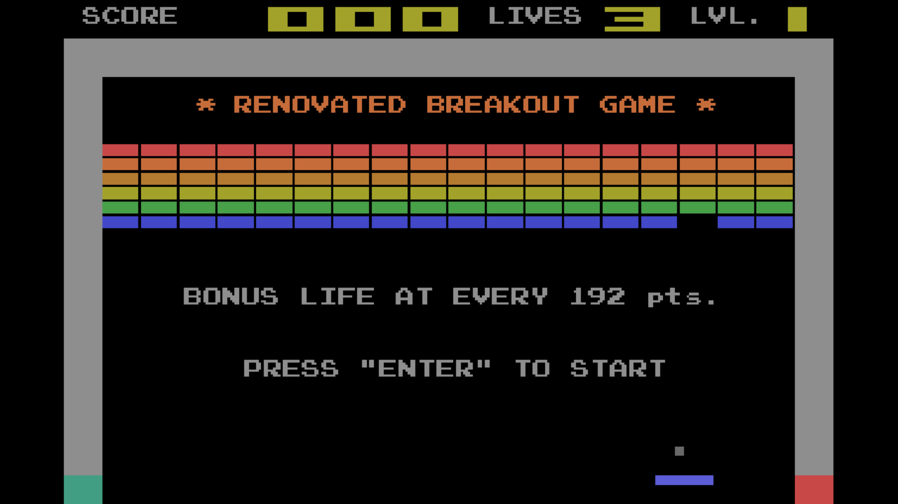

# Renovated Breakout Game Using `vbPixelGameEngine`



## Description
This project is a revitalized version of the classic Breakout game, developed with [vbPixelGameEngine](https://github.com/DualBrain/vbPixelGameEngine). Adapted from the "Breakout2" sample project by the engine's creator, this version has been refined with creative enhancements like Attraction Mode and arcade-style gameplay mechanics.

Number patterns within the game have been restructured into a YAML file to avoid hardcoding. The game supports audio playback, while sprite-based graphics are not utilized. The background music is sourced from *Space Invaders '91* for the Sega Genesis, and sound effects are taken from *Arkanoid* for the Nintendo Entertainment System.

The player can score over 1000 points even though the scoreboard displays numbers in its current format. Each block is worth 1, 3, or 5 points. The game concludes when the player either successfully completes Level 9 or runs out of lives. Previous game data is saved and displayed on the screen after the game ends.

## Prerequisites
- [.NET SDK](https://dotnet.microsoft.com/en-us/download/): version 9.0 or later
- IDE: Visual Studio 2022 or Visual Studio Code
- Required NuGet packages: YamlDotNet 16.3.0 and NAudio 2.2.1

## How to Play
1. Clone this repository to your local machine:
```bash
git clone https://github.com/Pac-Dessert1436/Renovated-Breakout-Game.git
```
2. Restore project dependencies and build the project:
```bash
dotnet restore
dotnet build
```
3. Open the project in Visual Studio 2022 or Visual Studio Code.
4. Run the game using `dotnet run` in VS Code, or the "Run" button in Visual Studio 2022.
5. In-Game Controls (not shown in captions):
    | Key        | Action          |
    |------------|-----------------|
    | Left/Right | Move the paddle |
    | P          | Pause / Resume  |
    | ESC        | Exit the game   |

## Personal Notes
With only 80 days left until the Postgraduate Entrance Exam of this year, and China's National Day holiday approaching, I find programming still more engaging than my TCM-related study materials. Yet I recognize that neglecting my studies to focus solely on programming isn't responsible at this stage. Currently, my study efficiency hinges entirely on motivation.

The Zengcheng Library is closed on Mondays, so I'm at home for now. Even when I occupy a fixed seat in the library's study room, maintaining focus is a struggle. Time waits for no one, and adulthood seems to propel us forward regardless of our readiness to pursue life's goals.

Contributing projects to GitHub fuels my passion, though I'm uncertain if this enthusiasm will endure once I start working. Still, I'm grateful to have this outlet, certainly better than venting frustration by yelling at a screen while playing online games. Well, after finalizing this project, I'm going to really take a break from GitHub until I complete my exam at the end of 2025!

## License
This project is licensed under the MIT License. See the [LICENSE](LICENSE) file for details.